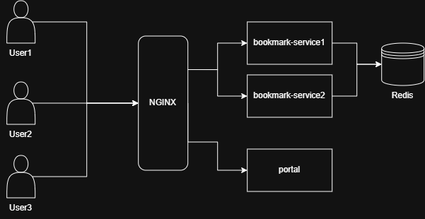

# Deployment & Infrastructure Guide

This directory contains the Docker Compose configurations and service settings required to deploy the **Bookmark Application** in a containerized environment (e.g., local staging, QA, or production).

## System Architecture

The deployment architecture consists of an **NGINX reverse proxy** acting as the API Gateway/Ingress. It routes incoming client requests to either the frontend web application (Portal) or a load-balanced set of backend API instances (**Bookmark Service**), which persist data in **Redis**.



## Service Descriptions

1. **NGINX Reverse Proxy (`nginx`)**:
   - Acts as the single entry point for all users.
   - Listens on host port `80`.
   - Distributes incoming traffic based on request URI prefixes.
   
2. **Portal (`portal`)**:
   - The user-facing web interface.
   - Served by `ebvn/bookmark-app-portal:dev`.
   - Accessible via the root path `/`.

3. **Bookmark Service (`bookmark_service`)**:
   - The backend REST API written in Go, served by `kimthanthien/bookmark:dev`.
   - Processes link shortening and redirection requests.
   - Resolves database state against Redis.

4. **Redis Cache (`redis`)**:
   - Active in-memory key-value database used by the Bookmark Service to map shortened codes to URLs.

---

## Routing & Port Mapping

| Ingress Path | Target Service | Internal Container Port | Description |
| :--- | :--- | :--- | :--- |
| `http://localhost/` | `portal` | `3000` | Serves the frontend application |
| `http://localhost/api/bookmark_service/` | `bookmark_service` | `8080` | Backend API routes (NGINX strips prefix and forwards) |

### NGINX Path Rewrite Rules
In `nginx/nginx.conf`, the trailing slashes are crucial to forward paths correctly to the backend service:
```nginx
location /api/bookmark_service/ {
    proxy_pass http://bookmark_service/;
}
```
* **Example**: A request to `http://localhost/api/bookmark_service/health-check` is rewritten and forwarded internally to `http://bookmark-service:8080/health-check`.

---

## Environment Configuration

### Bookmark Service Configurations (`./bookmark-service/.env`)
The service reads environment variables via `envconfig`. The default production-ready configurations are:

```env
ADDRESS=redis:6379              # Redis connection address (uses Docker DNS)
BASE_PATH=/api/bookmark_service # Base path for generating Swagger documentation
```

Additional optional environment overrides:
* `SERVICE_NAME`: Custom service identifier (defaults to `health-check-service`).
* `INSTANCE_ID`: Custom unique instance tag. If left blank, a random UUID is generated on startup.
* `LOG_LEVEL`: Logging verbosity level (e.g., `info`, `debug`, `warn`).
* `APP_PORT`: Internal container port for the API server (defaults to `8080`).

---

## Quick Start

### 1. Prerequisites
Ensure you have Docker and Docker Compose (v2 or newer) installed.

### 2. Startup Services
Navigate to this directory and bring up all containers in detached mode:
```bash
docker compose up -d
```

### 3. Verification
Once the containers are running, you can test key endpoints:
* **Frontend UI**: [http://localhost/](http://localhost/)
* **Health Check Endpoint**: [http://localhost/api/bookmark_service/health-check](http://localhost/api/bookmark_service/health-check)
* **Swagger API Documentation**: [http://localhost/api/bookmark_service/swagger/index.html](http://localhost/api/bookmark_service/swagger/index.html)

### 4. Stop Services
To stop and remove containers and network settings:
```bash
docker compose down
```

---

## Scaling the Bookmark Service

By default, `docker-compose.yaml` defines a static `container_name: bookmark-service` for convenience. To scale the application to run multiple instances behind the proxy (as shown in the architecture diagram):

1. Edit [docker-compose.yaml](file:///d:/CODE/Golang/golang-dev/deployment/docker-compose.yaml) and comment out or remove the static container name:
   ```yaml
   bookmark_service:
     image: kimthanthien/bookmark:dev
     restart: always
     # container_name: bookmark-service  <-- Comment out or remove this
     depends_on:
     - redis
     env_file:
     - ./bookmark-service/.env
   ```
2. Run Docker Compose with the `--scale` parameter:
   ```bash
   docker compose up -d --scale bookmark_service=2
   ```
   *Docker Compose will automatically create two separate containers, and Docker's internal DNS resolver will load-balance requests made to `http://bookmark-service:8080/` round-robin across both instances.*
